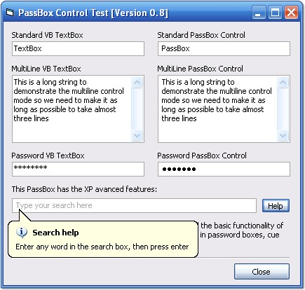



## PassBox \*\*Major Update\*\*

### Description

Replacement for the standard VB textbox. This has single and multiline as well as password styles. Password style has an XP look because it uses an standard edit control.

Also this control is protected against WM_GETTEXT and GetWindowText (tested with Spy++).

This is a major update with bugfixes, event implementation and new features like cue banner and balloon tip support. Compile and see.

Comments, bug reports and suggestions are welcome and remeber to vote!
 
### More Info
 

             |
---                |---
**Submitted On**   |2006-09-08 14:31:46
**By**             |[BioHazardMX](https://github.com/Planet-Source-Code/PSCIndex/blob/master/ByAuthor/biohazardmx.md)
**Level**          |Intermediate
**User Rating**    |4.8 (19 globes from 4 users)
**Compatibility**  |VB 6\.0
**Category**       |[Custom Controls/ Forms/  Menus](https://github.com/Planet-Source-Code/PSCIndex/blob/master/ByCategory/custom-controls-forms-menus__1-4.md)
**World**          |[Visual Basic](https://github.com/Planet-Source-Code/PSCIndex/blob/master/ByWorld/visual-basic.md)
**Archive File**   |[PassBox\_\_\_201883982006\.zip](https://github.com/Planet-Source-Code/biohazardmx-passbox-major-update__1-66425/archive/master.zip)

